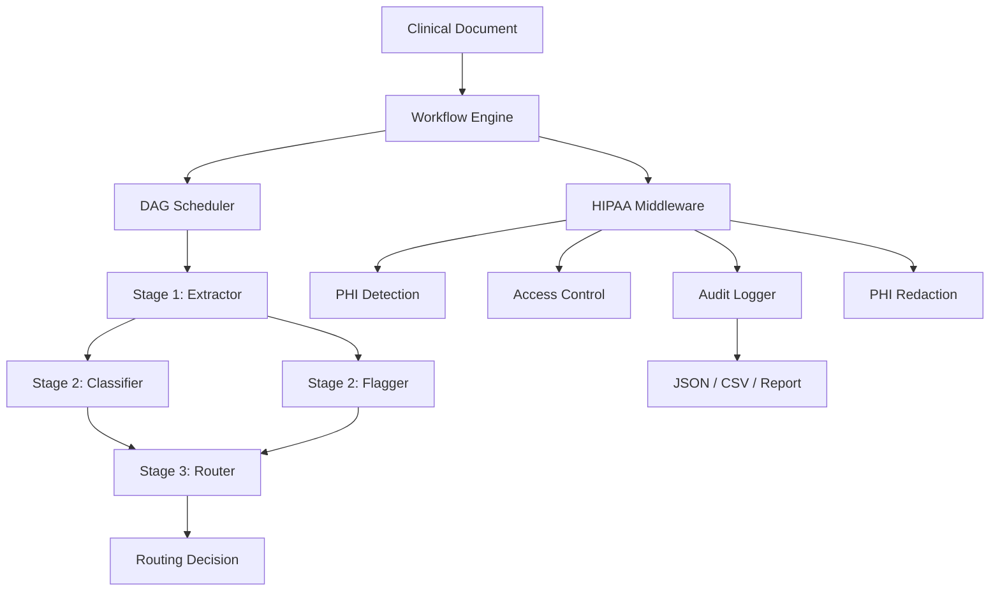

# Health Agents

[](LICENSE)
[](https://nodejs.org)
[](https://github.com/shaan-ad/health-agents/actions)

**HIPAA-compliant multi-agent orchestration for healthcare.**

Define multi-agent workflows as DAGs. Every agent action passes through a compliance middleware that enforces PHI access control, automatic redaction, and immutable audit logging. Ships with a clinical document processing template.

## Why This Exists

Multi-agent orchestration is powerful, but existing frameworks have zero healthcare awareness: no PHI detection, no access control, no compliance audit trails, no clinical templates.

Healthcare organizations need orchestration that is compliant by default. Health Agents makes HIPAA compliance structural, not optional.

**What's built in:**

- **PHI detection** for all 18 HIPAA Safe Harbor identifiers
- **Role-based access control** with four PHI access levels
- **Immutable audit logging** with hash-chained tamper detection
- **Automatic PHI redaction** for agents without sufficient access
- **Patient consent tracking** with scope and expiration
- **Clinical workflow templates** ready to use out of the box
- **Provider-agnostic** LLM support (Claude, OpenAI)

## Quick Start

```bash
# Install
npm install health-agents @anthropic-ai/sdk

# Configure
export HEALTH_AGENTS_PROVIDER=anthropic
export ANTHROPIC_API_KEY=your-key

# Run the clinical document processing template
npx ts-node examples/clinical-doc-processing.ts
```

## How It Works



Every LLM call from every agent passes through the HIPAA middleware automatically. Compliance is structural, not opt-in.

## Define a Workflow

```typescript
import { workflow, WorkflowEngine, BaseAgent, type AgentContext } from "health-agents";

class TriageAgent extends BaseAgent {
  getSystemPrompt() {
    return "You are a clinical triage specialist.";
  }
  async process(input: unknown, context: AgentContext) {
    const response = await context.complete(JSON.stringify(input));
    return JSON.parse(response.content);
  }
}

const triageWorkflow = workflow("triage")
  .agent("triage", TriageAgent, { phi_access: "read" })
  .build();

const engine = new WorkflowEngine(provider);
const result = await engine.execute(triageWorkflow, patientData);
```

## HIPAA Compliance Features

### PHI Detection

Detects all 18 HIPAA Safe Harbor identifiers: names, DOB, SSN, MRN, phone, email, address, ZIP, account numbers, license numbers, device identifiers, URLs, IP addresses, biometric IDs, photos, vehicle IDs, ages over 89, and other unique identifiers.

Three sensitivity levels: `strict`, `standard`, `relaxed`.

### Access Control

Agents declare their PHI access level. The middleware enforces it:

```typescript
workflow("example")
  .agent("extractor", ExtractorAgent, { phi_access: "read" })        // Can read PHI
  .agent("router", RouterAgent, { phi_access: "metadata_only" })     // PHI auto-redacted
  .agent("formatter", FormatAgent, { phi_access: "none" })           // Blocked from PHI
```

### Audit Logging

Immutable, hash-chained audit trail. Every action logged with actor, action, resource, data classification, and outcome. Tamper-evident by design.

```typescript
import { exportAsJSON, exportAsCSV, exportAsReport } from "health-agents";

const report = exportAsReport(engine.auditLogger);
const integrity = engine.auditLogger.verifyIntegrity(); // { valid: true }
```

### Consent Tracking

Verify patient consent before processing:

```typescript
engine.consentTracker.recordConsent({
  patientId: "patient-001",
  consentType: "data_processing",
  granted: true,
  grantedAt: Date.now(),
  scope: ["extraction", "classification"],
});
```

## Clinical Document Processing Template

Built-in four-agent pipeline:

| Agent | PHI Access | What it does |
|-------|-----------|-------------|
| **Extractor** | read | Raw text to structured data (diagnoses, medications, labs, procedures) |
| **Classifier** | read | Document type, department, urgency level |
| **Flagger** | read | Anomalies, missing fields, critical values, drug interactions |
| **Router** | metadata_only | Routing decision with destination, priority, rationale |

```typescript
import { createClinicalDocProcessingWorkflow, WorkflowEngine } from "health-agents";

const workflow = createClinicalDocProcessingWorkflow();
const engine = new WorkflowEngine(provider);
const result = await engine.execute(workflow, clinicalDocument);
```

See [docs/clinical-doc-processing.md](docs/clinical-doc-processing.md) for details.

## Architecture

```
src/
  orchestrator/     # DAG engine, workflow builder, agent runtime, message bus
  compliance/       # PHI detection, access control, audit logging, encryption
  providers/        # LLM provider adapters (Anthropic, OpenAI)
  templates/        # Clinical workflow templates
  types/            # TypeScript types (clinical, compliance, workflow)
```

See [docs/architecture.md](docs/architecture.md) for the full system design.

## Contributing

Contributions welcome. See the [docs](docs/) for architecture details.

```bash
git clone https://github.com/shaan-ad/health-agents.git
cd health-agents
npm install
npm test
```

## License

MIT
